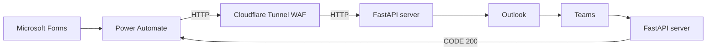
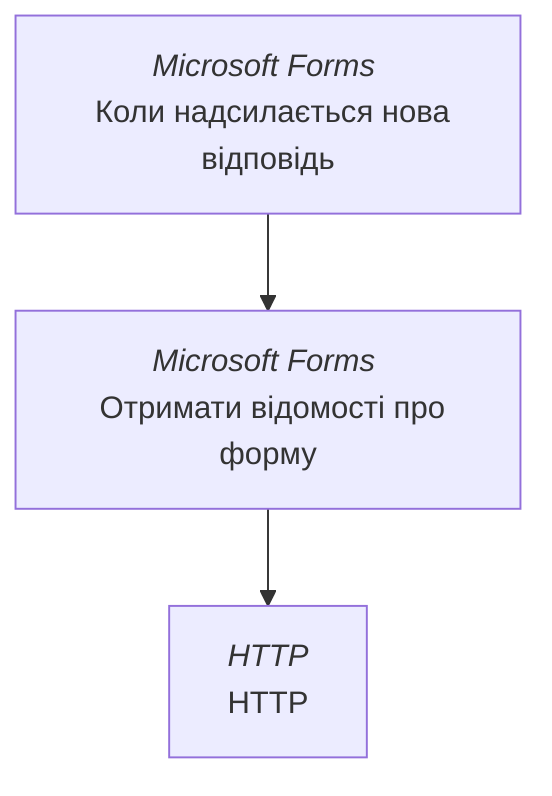

<h1 align="center"> Automatization AD</h1>

<p align="center">
  <b style="font-size: 1.2em">Автоматизація для створення облікових записів в Active Directory.</b><br/>
  Ця автоматизація створена щоб полегшити життя ІТ-спеціалістам які вручну створюють облікові записи для користувачів в Active Directory. Скрипт бере дані які ввів HR в Microsoft Forms обробляє їх та створює обліковий запис в AD, надсилає лист ІТ-wellcome керівнику, та короткий звіт в приватний канал Microsoft Teams.
</p>

## 💻 Tech Stack:


### ⚠️ Для роботи автоматизації потрібна підписка "Power Automate Premium"


## Алгоритм роботи 


В кореневій теці буде автоматично створено паку `.LOGS` в яку будуть записуватись логи про створених користувачів та групи які були їм назначені.

## Зміст
1. [Підготовка віртуальної машини для запуску проекту](#підготовка-віртуальної-машини-для-запуску-проекту)
2. [Налаштування структури та груп](#налаштування-структури-та-груп)
3. [Налаштування документу ІТ-wellcome](#налаштування-документу-іт-wellcome)
4. [Змінні оточення](#змінні-оточення)
5. [Налаштування додатку в Entra](#налаштування-додатку-в-entra)
6. [Налаштування планувальника задач (автоматичний запуск скрипта)](#налаштування-планувальника-задач-автоматичний-запуск-скрипта)
7. [Налаштування Cloudflare Tunnel](#налаштування-cloudflare-tunnel)
8. [Налаштування Microsoft Forms](#налаштування-microsoft-forms)
9. [Налаштування Power Automate](#налаштування-power-automate)


## Підготовка віртуальної машини для запуску проекту
Потрібно розгорнути та базово налаштувати віртуальну машину на сервері, підійде ОС Windows 10/11 x64.
На розгорнутій ОС потрібно встановити Python, RSAT та LibreOffice (для редагування та конвертування файлу ІТ-welcome). Відкрийте PowerShell з правами адміністратора та запустіть наступні команди:
1. Встановлення Python - **`winget install Python.Python.3 --scope machine`**
1. Встановлення RSAT - (Якщо у вас Windows 10 або 11 (Pro/Enterprise)) - **`Add-WindowsCapability -Online -Name Rsat.ActiveDirectory.DS-LDS.Tools~~~~0.0.1.0`**
    - Якщо у вас Windows Server - **`Add-WindowsFeature RSAT-AD-PowerShell`**
    - Якщо у вас Windows Server, але команда не працює - **`Install-WindowsFeature RSAT-AD-PowerShell`**
1. Встановлення LibreOffice (він потрібен для конвертації документу ІТ-wellcome в pdf формат) - **`winget install LibreOffice.LibreOffice`**
1. Також для зручності потрібно встановити Visual Studio Code  - **`winget install Microsoft.VisualStudioCode`**
1. Перевірка результату.
Після встановлення (це може зайняти декілька хвилин) перевірте, чи став доступний Python, модуль AD, LibreOffice, та Visual Studio Code.<br> Перевірити можна наступними командами:<br>
**`python --version`**,<br>
**`Import-Module ActiveDirectory`**,<br>
**`Get-Command -Module ActiveDirectory`**,<br>
**`soffice --version`**,<br>
**`code --version`**


- Створіть теку  **Scripts** на диску С.
- Клонуйте в теку **C:\Scripts** репозиторій з GitHub командою `git clone https://github.com/Victor-Yatsenko/automatizationAD.git`
- Створіть віртуальне середовище в проекті. Для цього відкрийте проект в раніше встановленому Visual Studio Code та виконайте цю команду в терміналі - **`python -m venv .venv`**
Після чого в корні проекту має з'явитись тека **.venv**.
Активуйте віртуальне оточення командою - **`.venv\Scripts\Activate.ps1`**
Виконайте команду **`pip install -r requirements.txt`** для встановлення бібліотек (необхідні бібліотеки вже прописані в файлі requirements.txt).


## Налаштування структури та груп
В теці <b>create_user</b> створіть теку <b>settings_for_ad</b> в ній створюємо два JSON файли, `ad_structure.json` та `groups.json`.<br>
В файлі `ad_structure.json` потрібно прописати вашу OU структуру Active Directory в форматі.

ПРИКЛАД
```JSON
{
    "Операційний департамент": {
            "dn": "OU=Операційний департамент,OU=ВАШЕ OU,DC=ВАШ ДОМЕН,DC=ВАШ ДОМЕН",
            "subdepartments": {
                "HR відділ": {
                    "dn": "OU=HR відділ,OU=Операційний департамент,OU=ВАШЕ OU,DC=ВАШ ДОМЕН,DC=ВАШ ДОМЕН"
                },


                "Фінансовий відділ": {
                    "dn": "OU=Фінансовий відділ,OU=ВАШЕ OU,DC=ВАШ ДОМЕН,DC=ВАШ ДОМЕН",
                    "subdepartments": {
                        "Бухгалтерія": {
                            "dn": "OU=Бухгалтерія,OU=ВАШЕ OU,DC=ВАШ ДОМЕН,DC=ВАШ ДОМЕН"
                        }
                    }
                },


                "ІТ відділ": {
                    "dn": "OU=ІТ відділ,OU=ВАШЕ OU,DC=ВАШ ДОМЕН,DC=ВАШ ДОМЕН"
                },
            }
        },


    "Назва департаменту": {
            "dn": "Повний OU (можна скопіювати з Active Directory) шлях",
            "subdepartments": {
                "Назва відділу": {
                    "dn": "Повний OU (можна скопіювати з Active Directory) шлях"
                } 
            }
        },
}
```

В файлі `groups.json` потрібно прописати назви груп Active Directory відповідно до департаментів в форматі. Саме те що ви вкажете в формі [тут](#налаштування-microsoft-forms) ([ Вибір ] Департамент) і потрібно прописувати в JSON.<br>

ПРИКЛАД
``` JSON
{
    "HR відділ":[
        "Група 1",
        "Група 2",
        ...
    ],
    "Бухгалтерія":[
        "Група 1",
        "Група 2",
        ...
    ],
    "ІТ відділ":[
        "Група 1",
        "Група 2",
        ...
    ]
}
```

## Налаштування документу ІТ-wellcome
Щоб коректно створювались та відправлялись листи з документом ІТ-wellcome потрібно в теці <b>create_user</b> створити теку <b>easy_start_docx</b>. В ній додаємо 2 docx файли з назвами `easy-start-front-office.docx` та `easy-start-back-office.docx` де будуть прописані стартові інструкції для працівника.<br>
В цих docx файлах потрібно вставити 2 рядки (скопіюйте те що знизу):<br>
`Ім'я користувача:	{{ name }}`<br>
`Пароль: {{ password }}`


## Змінні оточення
**Всі необхідні змінні оточення розписано в файлі .env.example**.<br>
Необхідно створити в корені проекту файл **".env"** в який додати змінні оточення з файлу **".env.example"** або просто можна перейменувати файл в **".env"**

**Щоб отримати змінну TEAMS_WEBHOOK_URL**.<br>
Потрібно в Teams створити канал (зробіть його приватним, там будуть паролі новостворених користувачів). Потім біля назви каналу натискаємо на три крапки -> Робочі процеси -> Усі шаблони -> тут знайдіть шаблон "Надсилати оповіщення веб-сигнальника в каналі". Створіть робочий процес. Після створення процесу в новому вікні буде кнопка **"Копіювати посилання на веб-сигнальник"**. і отримаєте https://... посилання.

Коли буде створено нового користувача в  прийде повідомлення в форматі:<br>
✅ В AD створено нового користувача<br>
🐣 Ім'я: ПІБ українською | Ім'я Прізвище англійською<br>
🏢 Відділ: Відділ<br>
💼 Посада: Посада англійською | Посада українською<br>
🔑 Пароль: Пароль<br>


**Наступні змінні заповніть даними своєї компанії**.<br>
OFFICE= назва офісу<br>
WEB_PAGE= веб-сторінка можна додати головний сайт компанії<br>
COMPANY= компанія<br>

**Щоб отримати змінні для розділу Entra App registrations**.<br>
Потрібно зареєструвати додаток в [Entra](#налаштування-додатку-в-entra).


#### **Щоб налаштувати змінну POWER_AUTOMATE_SECRET_TOKEN**.<br>
Потрібно створити 32 (можна і більше) значний токен (це значення використовується в [Power Automate](https://make.powerautomate.com/), [налаштування Power Automate](#налаштування-power-automate) буде нижче).<br>

Згенерувати можна за допомогою Python скрипта нижче
```python
import secrets
print(secrets.token_hex(32))
```


**Змінні для розділу FastAPI**.<br> якщо будете змінювати то потрібно змінити і в файлі <b>run_automationAD.bat</b><br>
`HOST=` # задайте IPv4, можна стандартний 127.0.0.1<br>
`PORT=` # наприклад 8080, або 8000<br>
`CREATE_USER_URL=` # шлях для створення користувача наприклад <b>/AD-automation-webhook/power-automate-webhook</b> (це значення використовується в Power Automate та в Cloudflare Tunnel)


**Пошти для надсилання листів**.<br>
Тут потрібно вказати пошти з якої і на які ми будемо відправляти листи. <b>УВАГА За замовчування скрипт відправляє лист ІТ-wellcome на пошту керівника</b><br>
`SENDER_EMAIL=` пошта відправника.<br>
`RECIPIENT_EMAIL=` пошта на яку буде дублюватись лист (умовно пошта it-support).


## Налаштування додатку в Entra
Потрібно зареєструвати додаток в [Entra](https://entra.microsoft.com/) -> App registrations. Згенерувати ключ в розділі Certificates & secrets (ключ генерується на визначений термін, після закінчення терміну дії ключа його потрібно перегенерувати і додати нове значення в файл **".env"** в змінну `CLIENT_SECRET=` , інакше додаток працювати не буде) Certificates & secrets (client secret) **обов'язкового як тільки згенеруєте ключ збережіть значення Value (Entra покаже його тільки 1 раз)**. Та надати права, для цього потрібно перейти в розділ API permissions натиснути Add a permission -> Microsoft Graph обрати потрібний тип і дати наступні права:

| API / Permissions name | Type        | Admin consent required |
| ---------------------- |:-----------:|:----------------------:|
| Mail.Send              | Application | Yes                    |
| User.Read.All          | Application | Yes                    |


## Налаштування планувальника задач (автоматичний запуск скрипта)
Щоб налаштувати автоматичний запуск скрипта потрібно зайти в планувальник задач. Натискаємо **Win + R** вводимо **taskschd.msc**. У новому вікні натискаємо **Create Task...**<br>

Вкладка General
- В полі Name даємо їм'я.<br>
- Нижче обираємо пункт Run whether user is logged on or not<br>
- Ставимо галку Run with highest privileges<br>

Вкладка Triggers
- Натискаємо New...
- В полі Begin the task: обираємо At startup
- Ставимо галку в пункті Enabled

Actions
- Натискаємо New...
- Action: Start a program
- Settings
    - Program/script: Вказуємо повний шлях до файлу <b>run_automationAD.bat</b>
    - Add arduments (optional): Залишаємо порожнім
    - Start in (optional): Вказуємо C:\Scripts\automatizationAD

Conditions та Settings залишаємо як є.

Натискаємо ОК, (попросить ввести пароль адміна), вводимо.
Скрипт буде кожні 5 хвилин перевіряти чи немає нових людей для створення облікового запису.


## Налаштування Cloudflare Tunnel
Логінимось в [Cloudflare Tunnel](https://dash.cloudflare.com/)

Заходимо в Protect & connect -> Application security -> WAF </br>
Натискаємо Create custom ruleset</br>
В полі Ruleset name вводимо назву правила. В Discription напишіть що робить (можна залишити пустим), наприклад Захист від DDoS та перебору для автоматизації АД.
В розділі Scope обираємо All incoming requests. Потім натискаємо Add rule.</br>
В пулі Ruleset name вводимо назву правила, наприклад "Захист від DDoS та перебору".</br>
В розділі When incoming requests match… потрібно заповнити поля так 

| Field    | Operator | Value |
| -------- |:-------- |:----- |
| URI Path | equals   | впишіть адресу, наприклад "/webhook power-automate" |
And
| Header   | ключ який ми створили [тут](#щоб-налаштувати-змінну-power_automate_secret_token) | does not equal = ключ який створили [тут](#щоб-налаштувати-змінну-power_automate_secret_token) |
And
| Country  | equals   | оберіть свою країну (будуть пропускатись тільки відповіді надіслані з цієї країни) |


</br>В розділі Then take action… вказуємо.
| Choose action    | With responce type                | With responce code |
| ---------------  |:--------------------------------- |:------------------:|
| Block            | Default Cloudflare WAF block page | 403                |


</br>
В розділі Execution order -> Select order = First</br>
</br>
В розділі Status = Active

Натискаємо Save. Правило готове.</br>

Далі йдемо в розділ Zero Trust (він знаходиться в меню зліва). В Zero Trust йдемо в Networks -> Tunnels & Proxies. Тут натискаємо Create a tunnel, в меню Select your tunnel type обираємо Cloudflared. Називаємо якось. В наступному розділі Install and run a connector потрібно обрати налаштування своєї ОС, в нас це Windows 64-bit. Завантажуємо .msi файл за посиланням яке надасть Cloudflare, встановлюємо на віртуалці з проектом, запускаємо від імені адміна, і вставляємо команду яку теж надасть Cloudflare. 

В розділі Connectors має з'явитись Connector ID = ваш ID | Status = Connected | Version = ваша версія</br>
Натискаємо Next. В наступному вікні Add a published application route for ... в розділах:
- #### Hostname</br>
    Вводимо Subdomain та обираємо домен.</br>
    Нижче буде Full hostname: його нам і треба буде вписати в Power Automate
- #### Service
    Type = HTTP
    URL = HOST:PORT  Ті значення що ви вказали [тут](#змінні-оточення) в файлі .env</br>

Cloudflare налаштовано.


## Налаштування Microsoft Forms
Заходимо в [Microsoft Forms](https://forms.cloud.microsoft/) і створюємо нову форму, (потім будемо [обробляти](#налаштування-power-automate) їх в Power Automate).</br>
В формі мають бути обов'язкові поля (<b>Краще створити окремі поля щоб уникнути помилок</b>):</br>
- [ Текст ] Прізвище (Кирилицею)
- [ Текст ] Ім'я (Кирилицею)
- [ Текст ] По батькові (Кирилицею)
- [ Текст ] Ім'я (Латиницею)
- [ Текст ] Прізвище (Латиницею)
- [ Вибір ] Місце роботи (з 1 відповіддю)
    - Front office
    - Back office
- [ Текст ] Телефон
- [ Текст ] Посада (Кирилиця)
- [ Текст ] Посада (Латиниця)
- [ Вибір ] Департамент (пододавайте туди ваші департаменти)
- [ Текст ] Прізвище керівника
- [ Текст ] Ім'я керівника


## Налаштування Power Automate
<b>Для налаштування потоку Power Automate потрібна підписка "Power Automate Premium"</b><br>
Зходимо в [Power Automate](https://make.powerautomate.com/) і створюємо новий Автоматизований хмарний цикл. Тригером потоку має бути "Коли надсилається нова відповідь" Microsoft Forms.<br>
Натиснувши на + додаємо нові дії "Отримати відомості про форму" потім "HTTP".<br>
Кінцевий цикл має виглядати так.<br>
<i>Italic = Категорія дії</i> 


- В дії "Коли надсилається нова відповідь" в поле Ідентифікатор форми вставляємо id форми яку створили в Microsoft Forms
- В дії "Отримати відомості про форму" вставте той же id
- В дії "HTTP"
    - В полі <b>URI</b> впишіть посилання яке згенеруєте [тут](#hostname)
    - В поті <b>Method</b> оберіть значення <b>POST</b>
    - В розділі <b>Headers</b>
        - <b>Введіть ключ</b> дайте назву заголовку наприклад Content-Type
        - <b>Значення ключа</b> application/json<br>
        Додайте ще поле
        - <b>Введіть ключ</b> наприклад X-Secret-Token
        - <b>Значення ключа</b> ключ який ми згенерували [тут](#щоб-налаштувати-змінну-power_automate_secret_token)<br>
        
    - Розділ Queries заповнювати не треба
    - В розділі Body потрібно натиснути вставити вираз в форматі JSON. В дужках trim() потрібно вставити "Динамічний вміст" з форми відповідно до пункту форми.<br>
    Наприклад поля ``` "front_or_back_office":"', trim(outputs('Отримати_відомості_про_відповідь')?['body/r4...']), ```

    ```json
    json(concat(
        '{"full_name_ua":"', 
        trim(Прізвище (Кирилицею)), ' ',
        trim(Ім'я (Кирилицею)), ' ',
        trim(По батькові (Кирилицею)),
        '","full_name_en":"', 
        trim(Ім'я (Латиницею)), ' ',
        trim(Прізвище (Латиницею)),
        '","front_or_back_office":"', 
        trim(Місце роботи),
        '","phone":"', 
        trim(Телефон),
        '","title_ua":"', 
        trim(Посада (Кирилиця)),
        '","title_en":"', 
        trim(Посада (Латиниця)),
        '","department":"', 
        trim(Департамент),
        '","manager":"', 
        trim(Прізвище керівника), ' ',
        trim(Ім'я керівника),
        '","action_status":"Success"}'
    ))
    ```

    - Розділ Cookie заповнювати не треба

Зберігаємо потік
## Проект налаштовано
